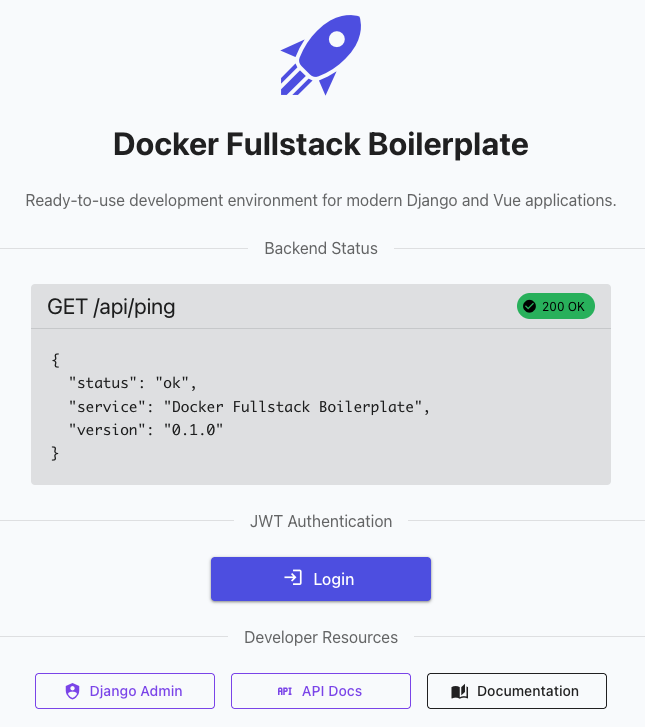
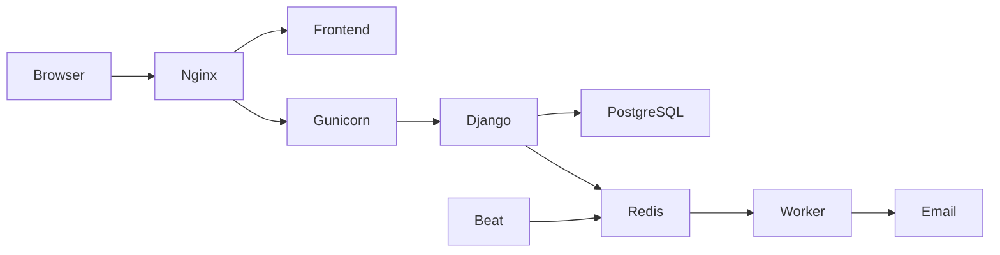

# 🚀 Docker Fullstack Boilerplate


Ready-to-use development environment for modern Django and Vue applications.

The goal of this project is to provide a clean, reusable and scalable foundation for future applications, following modern development practices and software architecture principles.

<p align="center">
  
</p>

## 📖 Overview

Docker Fullstack Boilerplate is developed incrementally with a focus on:

- Containerized development workflows
- Clean backend architecture
- Modern frontend integration
- Automated code quality checks
- Production-oriented configuration

The project provides a complete foundation including backend, frontend and infrastructure services.

### Architecture



## 🛠️ Tech Stack

### Backend

- Python 3.13
- Django 5.2
- Django REST Framework
- PostgreSQL
- Redis
- Celery

### Frontend

- Vue 3

### Infrastructure

- Docker
- Docker Compose
- Nginx
- Makefile

### Development Tools

- Ruff
- Pyright
- Pytest

## 📂 Project Structure

```text
.
├── backend/
├── frontend/
├── nginx/
├── compose.dev.yml
├── compose.prod.yml
├── Makefile
└── README.md
```

## ⚙️ Requirements

Before getting started, make sure you have the following installed:

- Docker Engine
- Docker Compose v2
- Git

## 🚀 Getting Started

Clone the repository:

```bash
git clone https://github.com/felmarlop/docker-fullstack.git
cd docker-fullstack

cp .env.example .env
```

Review the `.env` file and adjust the configuration to match your local environment if needed.

Build the development environment and create a Django superuser:

```bash
make build

make create-superuser
```

## ✨ Features

### Infrastructure
- Docker Compose development environment
- Environment-based configuration
- Makefile development commands
- Automated linting and type checking
- Nginx reverse proxy
- Development and production Docker configurations
- Gunicorn application server

### Backend
- Django REST Framework backend
- PostgreSQL database
- Redis message broker
- Celery background workers
- Persistent database storage
- PostgreSQL health checks
- Console email backend for local development
- Production-ready SMTP configuration

### Frontend
- Vue frontend integration
- Static and media file serving through Nginx

## 🧰 Commands

The project provides a set of Makefile shortcuts to manage the development environment.

| Command                           | Description                                 |
| --------------------------------- | ------------------------------------------- |
| `make start`                      | Start the containers                        |
| `make stop`                       | Stop the containers                         |
| `make restart`                    | Restart the containers                      |
| `make build`                      | Rebuild the images and start the containers |
| `make backend-shell`              | Open a shell in the backend container       |
| `make frontend-shell`             | Open a shell in the frontend container      |
| `make celery-beat-shell`          | Open a shell in the Celery Beat container   |
| `make celery-worker-shell`        | Open a shell in the Celery Worker container |
| `make reload-nginx`               | Check and reload the Nginx configuration    |
| `make create-superuser`           | Create Django superuser                     |
| `make generate-django-secret-key` | Generate a new Django secret key            |
| `make logs`                       | Show general logs                           |
| `make logs-backend`               | Show backend logs                           |
| `make logs-frontend`              | Show frontend logs                          |
| `make logs-nginx`                 | Show Nginx logs                             |
| `make logs-celery-worker`         | Show Celery Worker logs                     |
| `make logs-celery-beat`           | Show Celery Beat logs                       |
| `make logs-postgres`              | Show PostgreSQL logs                        |
| `make logs-redis`                 | Show Redis logs                             |
| `make backend-lint`               | Check code formatting and linting with Ruff |
| `make backend-lint-fix`           | Apply Ruff formatting and lint fixes        |
| `make backend-test`               | Run the test suite                          |
| `make backend-type-check`         | Run Pyright static type checking            |

## Environment Variables

The project configuration is managed through the root .env file.
The `.env.example` file contains every available configuration option with sensible development defaults.

All sensitive configuration (database credentials, email settings, JWT, CORS, etc.) is managed through environment variables using **django-environ**.

### Production

Additional commands are available for production deployments:

- `make build-prod`
- `make start-prod`
- `make stop-prod`
- `make restart-prod`
- `make shell-prod`
- `make logs-prod`

## 🌐 Reverse Proxy

The project uses **Nginx** as the front-facing web server.

Nginx sits between the client and the application, acting as a reverse proxy.

Its responsibilities include:

- Forwarding requests to the Django application.
- Serving static files efficiently.
- Serving user uploaded media files.
- Preparing the project for HTTPS and production deployments.

During development, Nginx is already used as the main entry point, while Django's development server remains accessible for debugging purposes.

## ⚡ Background Tasks

The project includes Celery, Redis and Celery Beat configured out of the box.

- **Celery Worker** executes asynchronous background tasks.
- **Celery Beat** schedules periodic tasks and sends them to the worker.
- **Redis** acts as the message broker between Django, Beat and the Worker.
- **django-celery-beat** allows periodic tasks to be managed through the Django admin without modifying application code.

Password reset emails are processed asynchronously through Celery, while recurring jobs can be managed from the Django admin using `django-celery-beat`.

## 🚦 Continuous Integration

Every push and pull request automatically runs the backend quality checks using GitHub Actions.

The CI pipeline executes:

- **make backend-lint**: Ruff (linting, formatting and import sorting)
- **make backend-type-check**: Pyright (static type checking)
- **make backend-test**: Pytest (test suite)

The workflow uses the same Docker environment as local development, ensuring consistent behavior across local machines and CI.

## 📌 Supported Versions

| Component      | Version |
| -------------- | ------- |
| Docker Engine  | 29.3    |
| Docker Compose | v2      |
| Python         | 3.13    |
| Django         | 5.2     |
| PostgreSQL     | 17      |
| Ruff           | 0.15.20 |

## 📄 License

License has not been defined yet.
