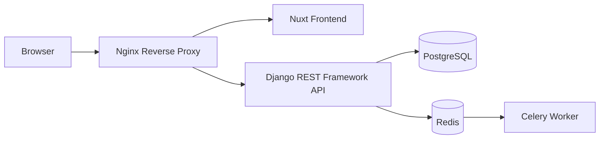

# 🚀 Docker Fullstack Boilerplate

[]()
[]()
[]()
[]()

A modern full-stack boilerplate for building Django applications with Docker, Django REST Framework and Nuxt.

The goal of this project is to provide a clean, reusable and scalable foundation for future applications, following modern development practices and software architecture principles.

## 📖 Overview

Docker Fullstack Boilerplate is developed incrementally with a focus on:

- Containerized development workflows
- Clean backend architecture
- Modern frontend integration
- Automated code quality checks
- Production-oriented configuration

The project provides a complete foundation including backend, frontend and infrastructure services.

### Architecture



## 🛠️ Tech Stack

### Backend

- Python 3.13
- Django 5.2
- Django REST Framework
- PostgreSQL
- Redis
- Celery

### Frontend

- Vue 3
- Nuxt

### Infrastructure

- Docker
- Docker Compose
- Nginx
- Makefile

### Development Tools

- Ruff
- Pyright
- Pytest

## 📂 Project Structure

```text
.
├── backend/
├── frontend/
├── nginx/
├── compose.dev.yml
├── compose.prod.yml
├── Makefile
└── README.md
```

## ⚙️ Requirements

Before starting, make sure you have installed:

- Docker Engine
- Docker Compose v2
- Git

## 🚀 Getting Started

Clone the repository:

```bash
git clone https://github.com/felmarlop/docker-fullstack.git

cd docker-fullstack
cp .env.example .env
```

Review the `.env` file and adjust the configuration to match your local environment if needed.

Build the development environment:

```bash
make build
```

## 📌 Supported Versions

| Component      | Version |
| -------------- | ------- |
| Docker Engine  | 29.3    |
| Docker Compose | 5.1     |
| Python         | 3.13    |
| Django         | 5.2     |
| PostgreSQL     | 17      |
| Ruff           | 0.15.20 |

## ✨ Features

- Docker Compose development environment
- Django REST Framework backend
- Nuxt frontend integration
- PostgreSQL database
- Redis service
- Celery background workers
- Environment-based configuration
- Persistent database storage
- PostgreSQL health checks
- Makefile development commands
- Automated linting and type checking

## 🧰 Commands

The project provides a set of Makefile shortcuts to manage the development environment.

| Command           | Description                                 |
| ----------------- | ------------------------------------------- |
| `make start`      | Start the containers                        |
| `make stop`       | Stop the containers                         |
| `make restart`    | Restart the containers                      |
| `make build`      | Rebuild the images and start the containers |
| `make shell`      | Open a shell in the backend container       |
| `make lint`       | Check code formatting and linting with Ruff |
| `make lint-fix`   | Apply Ruff formatting and lint fixes        |
| `make test`       | Run the test suite                          |
| `make type-check` | Run Pyright static type checking            |

## 🚦 Continuous Integration

Every push and pull request automatically runs the backend quality checks using GitHub Actions.

The CI pipeline executes:

- **make lint**: Ruff (linting, formatting and import sorting)
- **make type-check**: Pyright (static type checking)
- **make test**: Pytest (test suite)

The workflow uses the same Docker environment as local development, ensuring consistent behavior across local machines and CI.

## 📄 License

License has not been defined yet.
